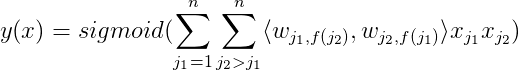
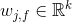
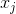
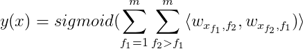
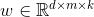
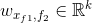

# CUDA FFM - Field-aware Factorization Machines on CUDA

CUDA FFM is an open-source tool for simplified Field-aware Factorization Machines (FFM).

The original FFM formulation can be found in this [paper](http://www.csie.ntu.edu.tw/~cjlin/papers/ffm.pdf) and original CPU implementation (libFFM) can be found on [github](https://github.com/guestwalk/libffm).

## Table of Contents

* [CUDA FFM components](#cuda-ffm-components)
* [FFM formulation](#ffm-formulation)
  * [Original FFM](#original-ffm)
  * [Simplified FFM](#simplified-ffm)
* [Installation](#installation)
* [Learning FFM](#learning-ffm)
* [Prediction using FFM](#prediction-using-ffm)
  * [Java bindings](#java-bindings)
* [Other utils](#other-utils)
  * [Example](#example-1)
  * [Text format of a dataset](#text-format-of-a-dataset)
  * [Model format](#model-format)


## CUDA FFM components

CUDA FFM consists of:
- very fast FFM trainer that trains FFM model using GPU
- very fast FFM prediction C++ library (using CPU)
    - Java bindings to that library (via JNI)
- few dataset management utils (splitting, shuffling, conversion)

## FFM formulation

### Original FFM

The original FFM is defined as:



where:
- `n` - is the number of features
- `m` - is the number of fields
- each `j`-th feature belongs to `f(j)`-th field
- `k` - is the factorization dimension (factor size)
- `<a, b>` - is a dot product of a and b
-  - is a weight vector for feature index `j` when multiplied by a feature belonging to field `f`
-  - is feature value of a `j`-th feature

### Simplified FFM

In simplified FFM:
- for each given sample, each field has exactly one feature value assigned (so `n` is always equal to `m`)
- all features are categorical, so  is always 1
    - if `d` is the hash space size, then feature indices belong to range `0, 1, ..., d-1`

Therefore:



#### Example

There are `m = 3` fields:

1. `day_of_week` - with 7 features belonging to this field
    - `x[0] = 1` for Monday and `x[1] = 1` for Tuesday
2. `age` - with 4 features: `0-13`, `14-18`, `18-30`, `30-inf`
3. `size` - with 3 features: `small`, `medium`, `large`

There are 2 samples with `n = 3` features each:

* `x = [0,0,1], y = 0` corresponding to `{ day_of_week: Monday, age: 0-13, size: medium, target: 0 }`
* `x = [4,0,1], y = 1` corresponding to `{ day_of_week: Friday, age: 0-13, size: medium, target: 1 }`

Assuming `HashSpaceSize` (`d`) is maximum feature index (i.e. 7), and `FactorSize` (`k`) is 4, then FFM weights would be 3 dimensional tensor with `7*3*4` weights ( and ).
FFM prediction for the second sample would be:

```
y = dot(w[4,1], w[0,0]) + dot(w[4,2], w[1,0]) + dot(w[0,2], w[1,1])
```

## Installation

Requirements:
- CUDA Toolkit 7.5 installed
- modern Linux distribution
- x86_64 platform
- g++ and make installed

```bash
export CUDA_PATH=/path/to/cuda # if CUDA is not installed in /usr/local/cuda-7.5
make
```

## Learning FFM
```bash
$ export CUDA_VISIBLE_DEVICES=<device-idx>
$ export LD_LIBRARY_PATH=/usr/local/cuda-7.5/lib64:$LD_LIBRARY_PATH

$ bin/learn --maxBatchSize       200                        \
          --l2reg                0.00001                    \
          --maxNumEpochs         10                         \
          --learningRate         0.2                        \
          --samplingFactor       1                          \
          --outputModelFilePath  model.out                  \
          --trainingDatasetPath  data/training_dataset.bin  \
          --testingDatasetPath   data/testing_dataset.bin

Learning model
Number of samples in training dataset: 711726176
Number of samples in testing dataset : 7196252
Number of fields: 74, hash space size: 1000000
L2 regularization: 0.00001, learning rate: 0.200000
Sampling factor: 1.000000, seed: 123
Max number of epochs: 10

Initial testing dataset log-loss: 9.061243

epoch epoch_duration testing_log_loss
    1      10638.747        0.0328052
    2      10682.063        0.0327166
...
```

Options are:

|param| description|
|----|---|
| `--l2reg <float>`                | L2-regularization penalty|
| `--maxNumEpochs <int>`           | number of epochs|
| `--learningRate <float>`         | learning rate|
| `--seed <int>`                   | random number generator seed|
| `--maxBatchSize <int>`           | performance related, use 200. Does not change convergence|
| `--samplingFactor <float>`       | how many negative (y = -1)_ data were subsampled. 1.0 for no subsampling|
| `--inputModelFilePath <string>`  | path to the input model. Optional|
| `--outputModelFilePath <string>` | path to the output model|
| `--trainingDatasetPath <string>` | path to the training dataset|
| `--testingDatasetPath <string>`  | path to the testing dataset|

## Prediction using FFM

The `src/main/resources/com/rtbhouse/model/natives/FactorizationMachineNativeOps.h` header file contains:

```c++
float ffmPredict(const float * weights, uint32_t numFields, const int32_t * features)
```

function that perform FFM prediction. The implementation uses AVX intrinsics to vectorize computation as much as possible.

### Java bindings

There is a small Java class `FactorizationMachineNativeOps` with `float ffmPredict(FloatBuffer weights, IntBuffer features)` method that delegates FFM prediction through JNI to native code.

Installation:

```bash
cd java
mvn clean compile exec:exec install
```

`ffm-native-ops` releases are also distributed through Maven central:

```xml
<dependency>
    <groupId>com.rtbhouse.model</groupId>
    <artifactId>ffm-native-ops</artifactId>
    <version>0.1.0</version>
</dependency>
```

## Other utils

- `bin/bin_to_text` - converts text dataset to binary dataset
- `bin/shuffler` - shuffles and merges datasets
- `bin/splitter` - splits datasets into training and testing one
- `bin/text_to_bin` - converts binary dataset to text dataset (for previewing)
- `bin/predict` - performs FFM prediction

### Example

```bash
# convert text features to fast binary format
./bin/text_to_bin < examples/dataset1.txt > dataset1.bin
./bin/text_to_bin < examples/dataset2.txt > dataset2.bin

# those two datasets are shuffled, so we can use shuffler to shuffle-merge them
./bin/shuffler dataset1.bin dataset2.bin > shuffled.bin

# split shuffled dataset into testing (10% samples) and training one (90% samples)
./bin/splitter shuffled.bin 0.10 testing.bin training.bin

# learn model
./bin/learn \
    --testingDatasetPath testing.bin   \
    --trainingDatasetPath training.bin \
    --outputModelFilePath model.out    \
    --samplingFactor 1.0

# perform prediction and calculate log-loss
./bin/predict model.out testing.bin 1.0
```

### Text format of a dataset

The text format of a dataset is:

```
<feature_1> <feature_2> ... <feature_n> <target_value_1>
<feature_1> <feature_2> ... <feature_n> <target_value_2>
...
```

where:
- `<target value>` is either -1 or 1
- `<feature_i>` is an integer from range `0 .. HashSpaceSize-1`
- space is a field separator, new line (`\n`) is a line separator

### Model format

Model weights () are stored using a text format:

```
<hash_space_size> <factor_size> <num_fields> <num_weights = hash_space_size * factor_size * num_fields>
<weights[0]>
<weights[1]>
...
<weights[num_weights-1]>
```


